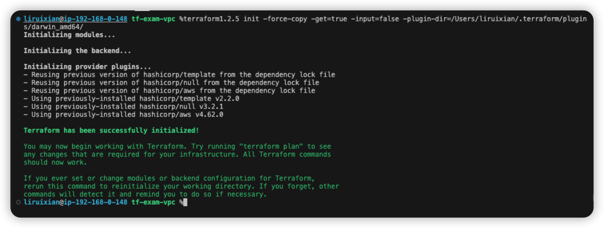
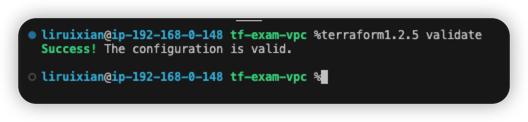

# tf-exam-vpc
All TF code for AWS resources are in dir ./vpc

All variables for TF code are in file ./local.tf

Specify the provider version in file ./provider.tf

Specify the terraform cli version in file ./versions.tf

The resule of "terraform validate" is ok

